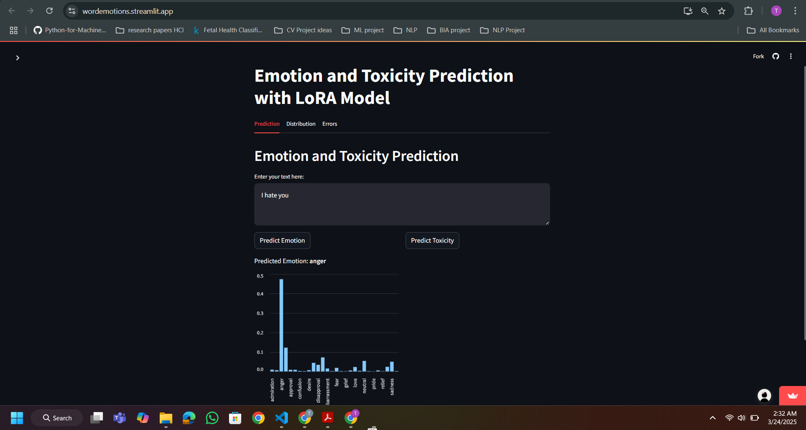
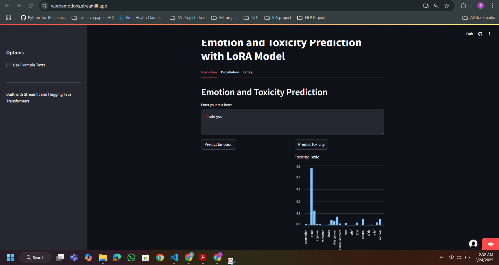
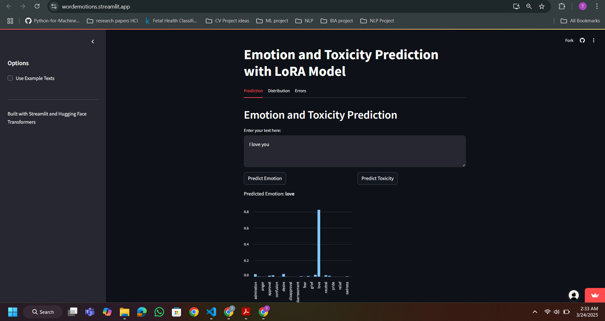
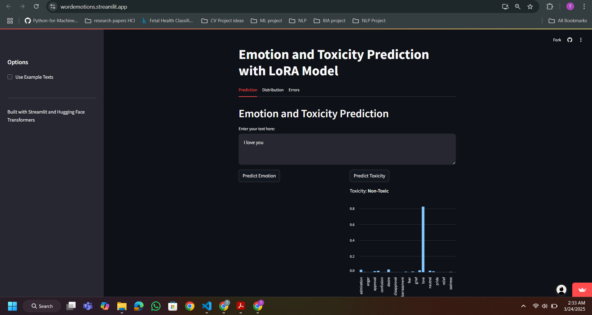
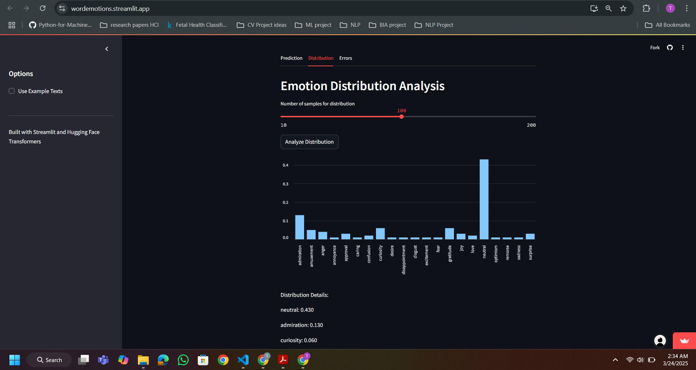

# A7_DISTILL_vs_LORA
## Task 1: Dataset
**Dataset:** https://huggingface.co/datasets/google-research-datasets/go_emotions
**Description:** The GoEmotions dataset contains 58k carefully curated Reddit comments labeled for 27 emotion categories or Neutral. 
The dataset consisted of different comments along with toxic/hate comments.
The labels are: "admiration", "amusement", "anger", "annoyance", "approval", "caring", "confusion", "curiosity",
    "desire", "disappointment", "disapproval", "disgust", "embarrassment", "excitement", "fear",
    "gratitude", "grief", "joy", "love", "nervousness", "optimism", "pride", "realization",
    "relief", "remorse", "sadness", "surprise", "neutral"

## Task 2: Odd Layer vs Even Layer Training

1) ## Training the Student Model with Odd Layers :
- I initialized a 6-layer student model (DistilBERT) from the 12-layer teacher model (BERT-base-uncased) using the distill_bert_weights function with layer_strategy='odd'. This copied weights from the odd-numbered layers of the teacher to the student’s 6 layers.
- **Optimizer:** I used the Adam optimizer with a learning rate of 5e-5. Adam was chosen for its adaptive learning rate properties, which help stabilize training and converge efficiently on the GoEmotions dataset.
- **Loss Function:** I employed BCEWithLogitsLoss for multi-label classification, suitable for the task of predicting multiple emotions per input.
- Training was performed over 3 epochs on the GoEmotions dataset, with the teacher’s logits guiding the student via distillation.
 
2) ### Training the Student Model with Even Layers :
- Similarly, I initialized another 6-layer student model, but this time used layer_strategy='even' to copy weights from the even-numbered layers of the teacher.
- **Optimizer:** Again, I used Adam with lr=5e-5 for consistency and its effectiveness in fine-tuning transformer models.
- **Loss Function:** BCEWithLogitsLoss was applied, matching the multi-label nature of the task.
- The training process mirrored the odd-layer setup, using 3 epochs on the same dataset.

## Task 3:
- **Model Setup:**
- I initialized a 6-layer DistilBERT model (distilbert-base-uncased) with 28 output labels for the GoEmotions dataset.
- Applied LoRA using the peft library with the following configuration:
        task_type="SEQ_CLS" (sequence classification).
        r=8 (rank of low-rank matrices).
        lora_alpha=32 (scaling factor).
        lora_dropout=0.1 (dropout rate).
        target_modules=["q_lin", "v_lin"] (targeting attention layers).
- This resulted in a model with 759,580 trainable parameters out of 67,734,584 total parameters (1.12% trainable).
- **Training:**
- Used the TrainingArguments with a learning rate of 2e-5, 3 epochs, batch size of 16, and fp16=True for efficiency on GPU.
- Trained on the GoEmotions "simplified" dataset, tokenized with padding and truncation to a max length of 128.
- **Optimizer:** Adam (implicit via Trainer), Loss: Cross-Entropy (default for single-label classification after processing multi-labels to single-label).
- **Evaluation:**
- Metrics: Accuracy and F1 (weighted).
- Results: Accuracy = 0.5294, F1 = 0.4861, Training Time ≈ 7:52 minutes.
- **Comparison with Odd and Even Layer Initializations**
    - **Performance:** The Even Layer model slightly outperforms both Odd Layer and LoRA in accuracy and F1 score, with Odd Layer close behind. LoRA lags by about 5% in accuracy and 8% in F1, suggesting that full fine-tuning with specific layer initializations captures more nuanced emotional patterns in GoEmotions.
    - **Efficiency:** LoRA is significantly more parameter-efficient, training only 1.12% of parameters compared to 100% for Odd/Even Layer models. It also trains in roughly half the time (~8 min vs. ~16 min), making it ideal for resource-constrained scenarios.
    Trade-off: LoRA sacrifices some performance for efficiency, while Odd and Even Layer initializations leverage full fine-tuning for better results at the cost of higher computational demand.

## Task 4:
1. 
### 📊 Quantitative Performance Comparison

| Model      | Accuracy | F1 Score (Weighted) | Validation Loss | Trainable Parameters | Total Parameters |
|------------|----------|---------------------|------------------|-----------------------|------------------|
| LoRA       | 0.5294   | 0.4861              | 1.5785           | 759,580               | 67,734,584       |
| Odd Layer  | 0.5720   | 0.5574              | 1.4384           | 66,975,004            | 66,975,004       |
| Even Layer | 0.5777   | 0.5671              | 1.3893           | 66,975,004            | 66,975,004       |

### ⚙️ Computational Efficiency

| Model      | Trainable Parameters | Trainable % | Training Time (3 Epochs) |
|------------|-----------------------|-------------|---------------------------|
| LoRA       | 759,580               | ~1.12%      | 7:52 (472 seconds)        |
| Odd Layer  | 66,975,004            | 100%        | 16:02 (962 seconds)       |
| Even Layer | 66,975,004            | 100%        | 16:20 (980 seconds)       |

### 📉 Training Loss Trends

| Epoch | LoRA   | Odd Layer | Even Layer |
|-------|--------|-----------|------------|
| 1     | 1.8585 | 1.6001    | 1.5037     |
| 2     | 1.6418 | 1.3463    | 1.2563     |
| 3     | 1.5595 | 1.1605    | 1.0672     |

- Even Layer is the top performer (57.77% accuracy, 56.71% F1), slightly ahead of Odd Layer (57.20% accuracy, 55.74% F1), making it the best choice for maximizing predictive power when resources are not a constraint. Its initialization with even layers (0, 2, 4) may provide a slight edge over odd layers (1, 3, 5).
- Odd Layer is nearly as effective, with only a marginal performance drop, suggesting layer selection has a subtle impact when fully fine-tuning.
- LoRA sacrifices ~4-5% accuracy and ~7-8% F1 for massive efficiency gains (1.12% trainable parameters, halved training time), making it suitable for resource-limited settings or rapid deployment, though it struggles with subtle emotions and class imbalance.
The choice between these methods depends on the use case: Even Layer for peak performance, LoRA for efficiency, and Odd Layer as a balanced alternative if even-layer initialization isn’t preferred.

2. 
### 🧪 Final Evaluation Summary

| Model Type | Training Loss | Test Set Performance                |
|------------|----------------|-------------------------------------|
| Odd Layer  | 1.1605         | Accuracy: 0.5720, F1: 0.5574        |
| Even Layer | 1.0672         | Accuracy: 0.5777, F1: 0.5671        |
| LoRA       | 1.5595         | Accuracy: 0.5294, F1: 0.4861        |

Implementing the Odd Layer, Even Layer (distillation fine-tuning), and LoRA fine-tuning methods on the GoEmotions dataset revealed distinct challenges. Distillation fine-tuning (Odd and Even Layer) faced high computational demands, as both methods fine-tuned all 66,975,004 parameters of the 6-layer DistilBERT model, leading to longer training times (16:02 and 16:20 minutes for 3 epochs) and significant memory usage. This made them resource-intensive, particularly for environments with limited GPU memory. n contrast, LoRA fine-tuning was far more efficient, training only 759,580 parameters (~1.12% of total) and completing in 7:52 minutes. However, this efficiency came at the cost of performance. 

**Proposed Imporvements:** For distillation fine-tuning, hybrid approaches like combining layer selection with LoRA could reduce computational demands while retaining performance—e.g., fine-tune only a subset of layers fully and apply LoRA to others. For LoRA, increasing the rank (r=8 to 16) or targeting additional modules (e.g., "k_lin", feed-forward layers) could enhance capacity without sacrificing efficiency. Fine-tuning LoRA for more epochs or using class-weighted loss could address the "neutral" bias and improve nuanced emotion detection, balancing efficiency and effectiveness for the GoEmotions task.

## Task 5
- **Overview**
The web application, built using Streamlit, interfaces with a LoRA-adapted DistilBERT model to perform emotion and toxicity prediction on user-provided text. The model, fine-tuned on the GoEmotions dataset, predicts one of 28 emotions, and a heuristic classifies text as "Toxic" or "Non-Toxic" based on negative emotions (e.g., "anger," "disgust"). The app provides an interactive interface with tabs for prediction, emotion distribution, and error analysis, along with bar charts for emotion probabilities.

- **How the Web Application Interfaces with the Model**
1) **Model Loading:**

- The load_model() function uses transformers and peft libraries to load a pre-trained DistilBERT-base-uncased model and a LoRA-adapted version from the local best_lora_model directory.
- The model is moved to the appropriate device (GPU if available, else CPU) and set to evaluation mode (model.eval()).
- The tokenizer is also loaded to preprocess text inputs.
2) **Text Preprocessing:**

- User or example text is tokenized using AutoTokenizer with padding, truncation, and a max length of 128 tokens.
- Inputs are converted to PyTorch tensors and moved to the device (cuda or cpu).
3) **Prediction:**

- The predict_emotion() function feeds tokenized inputs to the model, retrieves logits, and applies softmax to get emotion probabilities.
- The predicted emotion is determined using argmax on the logits, mapped to one of the 28 emotion_labels.
- The predict_toxicity() function classifies the text as "Toxic" if the predicted emotion is in toxic_emotions (e.g., "anger," "sadness"), otherwise "Non-Toxic."
4) **Batch Prediction:**
- The batch_predict() function processes multiple texts for distribution and error analysis, returning a list of predicted emotions.
5) **Visualization:**
- Streamlit’s st.bar_chart() displays emotion probabilities for each prediction.
- Tabs like "Distribution" and "Errors" use batch predictions to show aggregated results (e.g., emotion distribution, error cases).

**Steps to Deploy the Application**

- **Prerequisites:**
Install Python 3.8+.
Install required packages: pip install streamlit torch transformers peft datasets numpy.
Ensure the best_lora_model directory (containing the LoRA-adapted model and tokenizer) is in the same directory as app.py.
Prepare the Code:
Save the modified app.py (from the previous response) in a directory.
Verify the best_lora_model path in the script matches the local directory structure.
Run the Application Locally:
Open a terminal in the directory containing app.py.
Run: streamlit run app.py.
Streamlit will launch a local server (e.g., http://localhost:8501) and open the app in your browser.

**Deploy to a Cloud Service**:
Streamlit Community Cloud:

Push the project to a GitHub repository (include lora.py, best_lora_model, and a requirements.txt with dependencies).
Sign up at streamlit.io, link your GitHub repo, and deploy the app via Streamlit Community Cloud.

**Steps to Use the Application**
Access the App:
Open the app URL [(https://wordemotions.streamlit.app/)](https://wordemotions.streamlit.app/)

**Prediction Tab:**
Enter text in the text area (default: "I can't believe how amazing this day turned out!").
Click "Predict Emotion" to see the predicted emotion and a bar chart of emotion probabilities.
Click "Predict Toxicity" to see if the text is "Toxic" or "Non-Toxic," with the same bar chart.
Alternatively, check "Use Example Texts" in the sidebar to analyze random GoEmotions samples.

**Distribution Tab:**
Select the number of samples (10–200) and click "Analyze Distribution" to view a bar chart of predicted emotion frequencies.

**Error Analysis Tab:**
Select the number of samples (10–100) and click "Analyze Errors" to see up to 5 misclassified examples with true and predicted emotions.

https://wordemotions.streamlit.app/

